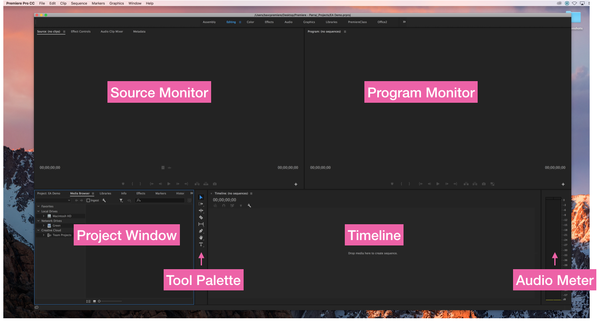
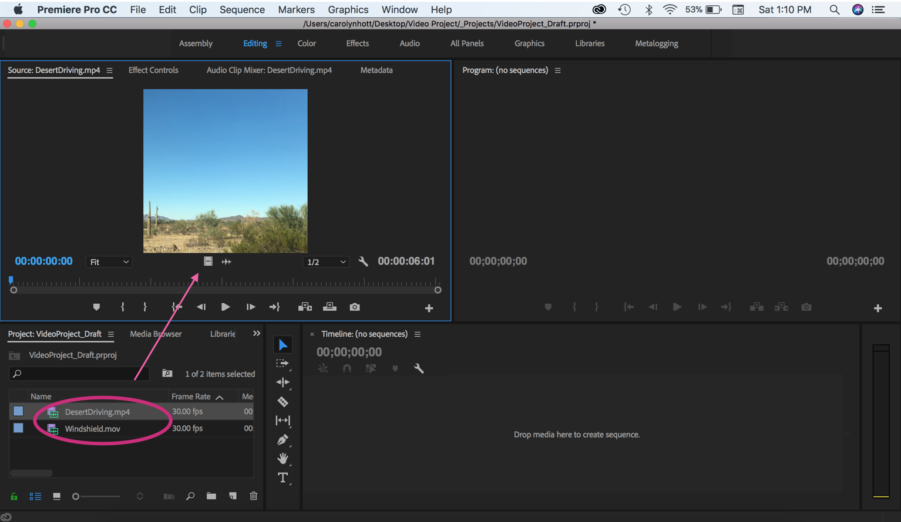
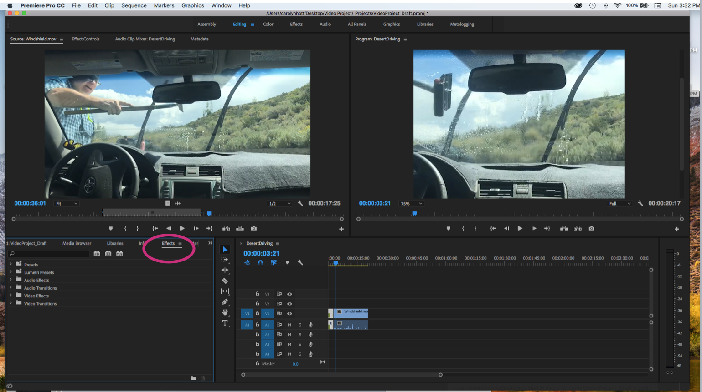
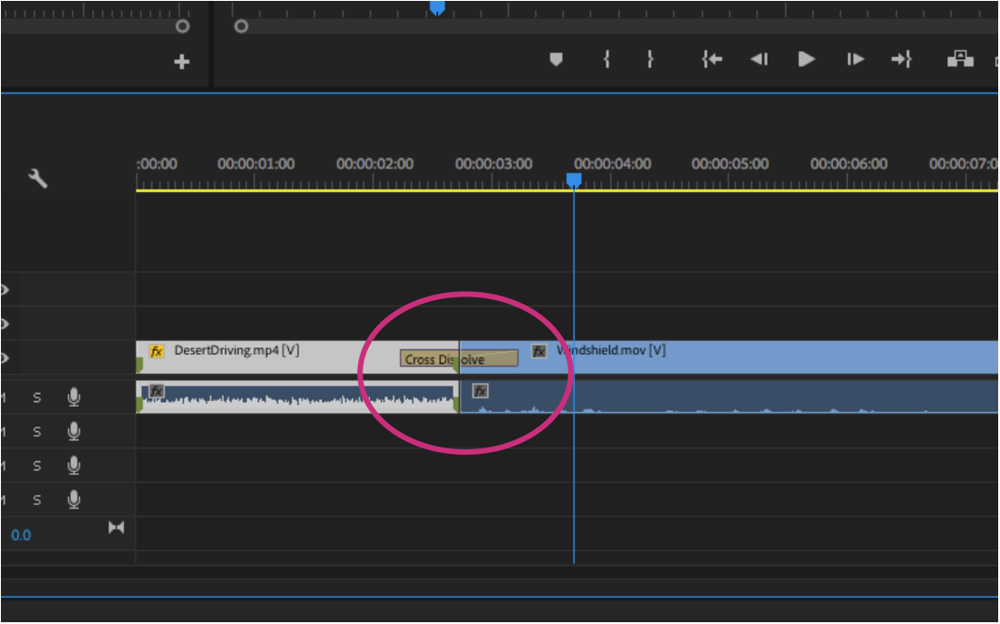
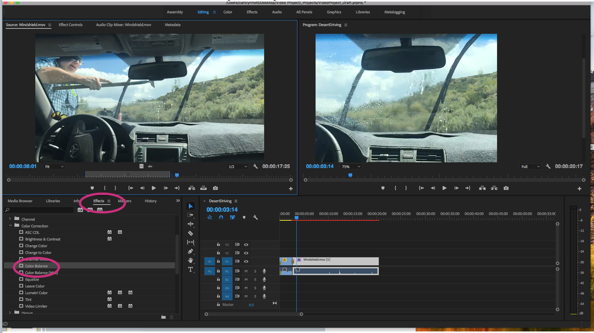
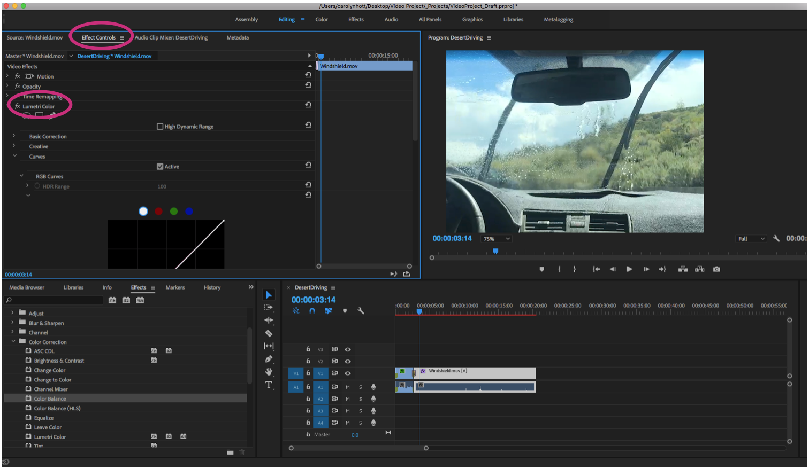
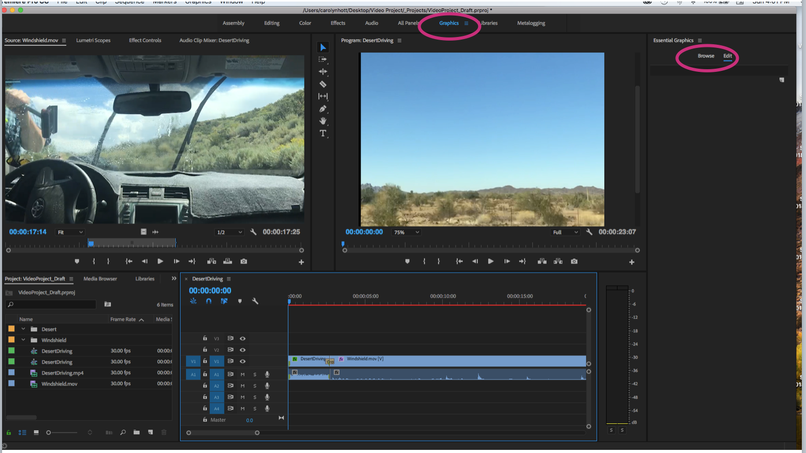
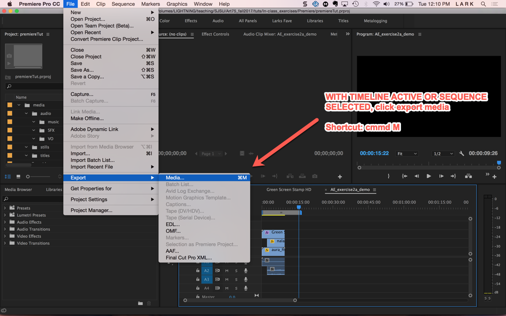

# Adobe Premiere 🎥📹💻

 ◇─◇──◇────◇────◇────◇────◇────◇─◇─◇
 

##### Included on this page:

1. [Assigned Tutorials](#-assigned-tutorials)
2. Tips and Resources
  1. [Setup - folder template and renaming files](#-setup)
  2. [Keyboard shortcuts](#-keyboard-shortcuts)
  3. [Getting Started with the Program](#-getting-started-with-premiere)
  3. [Color Correction](#-color-correction)
  4. [Captions and Subtitles](#-captions-and-subtitles-using-premieres-built-in-tool)
  5. [Working with Audio](#-working-with-audio)
  6. [Exporting](#-exporting)

 

# ▼△▼△▼ Assigned tutorials

##### Tutorials from Lynda.com
----> [Here is the Link](https://www.lynda.com/portal/patron?org=sjlibrary.org&triedlogout=true) to log in to Lynda with San Jose Public Library Card (or just do a search for "Lynda SJPL").

We will watch [Premiere Pro CC 2017 Essential Training: The Basics ](https://www.lynda.com/Premiere-Pro-tutorials/Premiere-Pro-CC-2017-Essential-Training-Basics/585268-2.html)

**Recommended intro tutorials:**
* Ch. 2 (just the second part: Taking a tour)
* All of Chapters 4, 5, and 7

**...More tutorials:**
* Chapter 9: Working with Effects
  - First four sections are optional: review of what we have covered in class about effects
* Chapter 10: Manipulating Clip Speed
  - Creating freeze frames and stills
  - Changing speed with the Rate Stretch tool and Speed/Duration window
* Chapter 11 Basic Color Correction
  - Optional: we will do demos in class on Thursday
* Chaper 12: Working with Titles
  - Watch all

 
 

# ▼△▼△▼ Setup

**Create a folder for all your in-class exercises.**

Organize your files with a consistent folder structure *that's the same for all your projects*. The easiest way to do this is to create a "workflow template" — a set of mostly empty folders that you copy and rename every time you start a new project.

Download the Video Workflow Template zip file in the [resources](../../resources) folder
  * Check out [this tutorial](https://www.techwalla.com/articles/how-to-open-a-mac-zip-file-in-windows) if you are having trouble unzipping it in Windows

It looks like this:  

 
 

Tutorials for renaming all your footage files at once:
* [Windows users](http://www.ubergizmo.com/how-to/batch-rename-files-windows/)
* [Mac users](https://www.imore.com/how-rename-multiple-files-once-mac)

 
 

# ▼△▼△▼ Keyboard Shortcuts

***TIME SAVERS***

Here is [a link](https://helpx.adobe.com/premiere-pro/using/default-keyboard-shortcuts-cc.html) to Adobe's full list of keyboard shortcuts. Below are notable ones to remember.

| Basic Operations          | Window       | Mac         |
|---------------------------|--------------|-------------|
|       Save                | Ctrl+S       | Cmd+S       |
|       Save As...          | Ctrl+Shift+S | Shift+Cmd+S |
|       Import...           | Ctrl+I       | Cmd+I       |
|       Undo                | Ctrl+Z       | Cmd+Z       |
|       Redo                | Ctrl+Shift+Z | Shift+Cmd+Z |
|       Cut                 | Ctrl+X       | Cmd+X       |
|       Copy                | Ctrl+C       | Cmd+C       |
|       Paste               | Ctrl+V       | Cmd+V       |
|       Select All          | Ctrl+A       | Cmd+A       |
|       Deselect All        | Ctrl+Shift+A | Shift+Cmd+A |
|       Find...             | Ctrl+F       | Cmd+F       |

| Sequence shortcuts                                        |              |             |
|--------------------------------------------------|--------------|-------------|
|       Play/Stop Toggle                           | Space or K   | Space or K  |
|         Play: Forward and Backward               | J,K,L        | J, K, L     |
|       Zoom In                                    | =            | =           |
|       Zoom Out                                   | -            | -           |
|       Match Frame                                | F            | F           |
|       Add Edit (like razor tool)                                | Ctrl+K       | Cmd+K       |
|       Add Edit to All Tracks                     | Ctrl+Shift+K | Shift+Cmd+K |
|            Render Effects in Work Area/In to Out | Enter        | Return      |
|       Apply Video Transition (dissolve)                     | Ctrl+D       | Cmd+D       |
|       Apply Audio Transition (cross-fade)                     | Ctrl+Shift+D | Shift+Cmd+D |
|       Lift                                       | ;            | ;           |
|       Extract                                    | '            | '           |
|       Mark In                                    | I            | I           |
|       Mark Out                                   | O            | O           |
|       Mark Clip                                  | X            | X           |
|       Go to In                                   | Shift+I      | Shift+I     |
|       Go to Out                                  | Shift+O      | Shift+O     |
|       Clear In                                   | Ctrl+Shift+I | Opt+I       |
|       Clear Out                                  | Ctrl+Shift+O | Opt+O       |
|       Add Marker                                 | M            | M           |
|       Go to Next Marker                          | Shift+M      | Shift+M     |
|       Go to Next Edit Point                      | Down         | Down        |
|       Go to Previous Edit Point                  | Up           | Up          |

| Tool Shortcuts       |   |   |
|----------------------|---|---|
|    Selection Tool    | V | V |
|    Track Select Tool | A | A |
|    Hand Tool         | H | H |
|    Zoom Tool         | Z | Z |
|      Slip Tool       | Y | Y |
|      Razor Tool      | C | C |

 
 
 

# ▼△▼△▼ Getting Started with Premiere

#### ▼ Open the Program

* When beginning a new project, choose new project.
* Route the Location to your Premiere-Projects folder in your Video Project folder
* In the next window, name your project
* Display format: Timecode
* Audio: Audio Samples
* Capture: DV (HDV is more compressed)
* Scratch Disks and Ingest Settings: Keep default

#### ▼ Set Up the Workspace

* Once the workspace is open, go to the ‘Editing’ interface. You can open new tabs in ‘Window’

#### ▼ What is the Workspace?

* The Editing Workspace is made up of four main windows: Source Monitor, Program Monitor, Timeline, Tool Palette, Project Window, and Audio Meters

#### ▼ Import Footage

* From the Media Browser in the Project Window, right click in the window (or Cmd I/Ctrl I) and select ‘Import” and locate footage on your computer
* Once footage is in the Media Browser you can hover over it to make sure it is the footage you want
* Footage is now in the ‘Media Bin’
* Double click on footage and it will show in the Source Monitor

#### ▼ View and Organize Footage

* Double click on footage and it will show in the Source Monitor
* In the Media Bin, rename and organize footage as desired- keep organized according to type of shot
* Press Command + B (mac) or Ctrl + B (windows) while in the bin in the Project window to create new ‘bins’ (folders) within your Media bin.

#### ▼ Select a clip within Footage

* If you don’t want to use all of your footage but want to select a clip within footage to use in your video:
* Click in your Source Monitor window and press play, or the space bar and decide what you want to use
* You can save the place of where you want your clip by using the ‘Marker’ arrows
* Where you want your clip to begin, press ‘I’, or use the ‘Mark In’ tool ‘{‘
* Where you want your clip to end, press ‘O’ or use the ‘Mark Out’ tool ‘}’

#### ▼ Put Footage in Timeline

* Once your clip is selected (if you chose one), drag from Source Monitor to Timeline, to put your selected clip in the timeline
* Drop the clip in the center closest to the dividing bar.
* It will show up on your timeline, displaying the audio below, and the video above.

#### ▼ View Timeline Project in Program Monitor

* When you press Play on the Program Monitor, or hit the Space Bar when in the Timeline, your footage will play.
* You can adjust the fit of your footage in the video under ‘Fit’
* You can double click on the video in the Program Monitor to reposition your footage

#### ▼ Add a Second Clip to the Timeline

* In the Media Bin, double click on the footage you would like to add so that it appears in the Source Monitor
* Select a clip as you did before (if desired), and drag from the Source Monitor to the Timeline

#### ▼ View Full Timeline Project in Program Monitor

* Your second clip should back up directly to your first clip on the Timeline
* Pull your Timeline Needle (or Playhead) to the beginning of your timeline, then hit the Space Bar to play through your project and see what you have in the Program Monitor

#### ▼ Add Transition Effects

* Select the Effects Window in the Project Window (where your Media Bin is)
* Click on Video Transitions to see a menu of transition types
* Click on Dissolves and select ‘Cross Dissolve’
* Drag from the Cross Dissolve box to the place on your Timeline where you want to transition (between your two clips)

#### ▼ View Transition

* The Cross Dissolve should appear as a bar that bridges two of your video clips (audio transitions are separate)
* Hover over the bridge with your mouse until a bracket appears- you can use this bracket to adjust the time span of the transition
* Play your project in the Program Monitor to view your transition

# ▼△▼△▼ Color Correction

Tutorials:
* [Adobe support docs (text)](https://helpx.adobe.com/premiere-pro/using/color-correction-adjustment.html)
* [Fast Color Corrector](https://www.youtube.com/watch?v=1drvNwiDEjU)
  * Easy color (white balance correction)
* [Basic correction with Lumetri](https://www.youtube.com/watch?v=0VDbf9VsZ88)

#### ▼ Adjust Exposure and Color

* In the Effects Window, Select Video Effects, then select Color Correction, and then select Color Balance
* Drag the Color Balance icon over to the clip in your Timeline that you would like to adjust

* Select the Effect Controls window, which is behind your Source Monitor
* Select Lumetri Color and scroll down to see the ‘Curves’ panel
* Here you can just Exposure, and Red, Green, and Blue (RGB!! Screen Colors) balance
* Select the Color and then move the curve to see the changes in the Program Monitor

 
 

# ▼△▼△▼ Captions and Subtitles using Premiere's built-in tool

You can create individual titles, but Premiere has a specific tool for creating closed-captions
* [Adobe support docs (text)](https://helpx.adobe.com/premiere-pro/using/working-with-captions.html)
* [Basic video tutorial on Captions and Subtitles](https://www.youtube.com/watch?v=ZhHG4f-9MBY)

#### ▼ Add a Title

* Select the Graphics Workspace
* In the Essential Graphics window, select ‘Browse’
* In the list, select ‘Basic Title’

* Drag ‘Basic Title’ to your timeline and place it at the beginning of your project, above your first clip
* The text will appear at the center of the screen on your clip

* Double click the title on your Timeline, then select ‘Your Title Here’ in the Graphics Window
* Click on the ‘Your Title Here’ box on your footage in the Program Monitor to type in your title. Move box to adjust placement.
* Adjust color and font size in the Text Window on the right side.

* Double click the title on your Timeline, then drag end backward or forward to adjust length of appearance in your project.  

 
 

# ▼△▼△▼ Working with Audio

* [Adobe support docs (text)](https://helpx.adobe.com/premiere-pro/user-guide.html?topic=/premiere-pro/morehelp/audio.ug.js)
* [Basic audio levels and fades](https://www.youtube.com/watch?v=t0IAJSFl5Ww)
* [Fine-tuning with audio within Premiere](https://www.youtube.com/watch?v=MmiRBsAshOQ)
* [Noise reduction using Adobe Audition with Dynamic Link](https://www.youtube.com/watch?v=0C9Cc8zSHm4)

 
 

# ▼△▼△▼ EXPORTING

Step-by-step tutorial on exporting.

For project 1 audio, follow these steps but export as WAV

