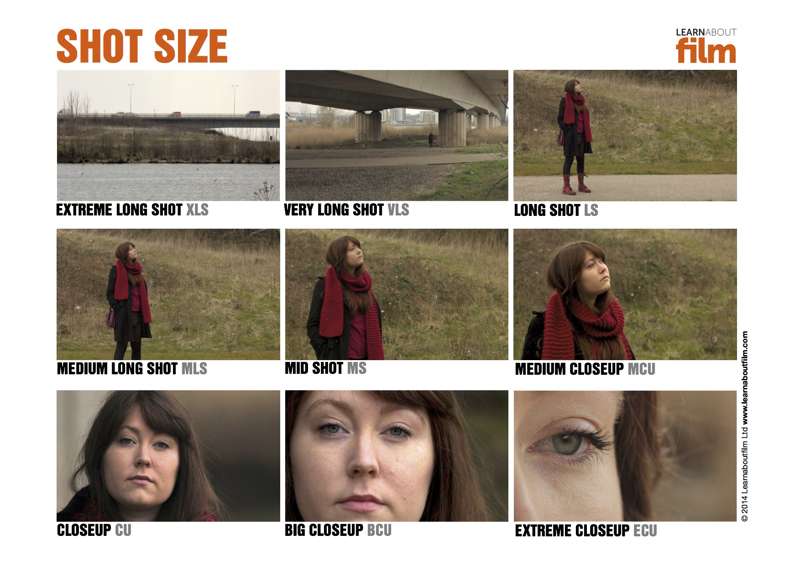

# Filmic Conventions

 ◇─◇──◇────◇────◇────◇────◇────◇─◇─◇
 

## ▼△▼△▼ Continuity editing

Continuity editing is the illusion of continuity of time and space in a sequence of shots. These are filmic conventions, but not requirements. It is worth it to know the rules, so that you know when to use them and when to break them.

#### Establishing shot

The establishing shot is often a wide shot that shows the viewer the location where all the action is happening. This is important for spatial continuity: it helps the viewer ground themselves in physical space.

#### Match on action

Edits that match action from one shot to another are read as continuous. It would break temporal continuity if we saw a raven land twice on the same fence.

#### Eyeline match

A shot of a character looking at something off-screen is followed by the shot of that person/object.

#### Cross-cutting / Parallel montage

Cutting between different actions that are occurring at the same time. The terms are used interchangeably, though cross-cutting might refer more to something happening in the same place (someone stealing chips at a corner store while the clerk is on their phone), while parallel montage could be action in different locations (simultaneous action in different parts of the world).

#### The 180 degree rule

Imagine there is an invisible line connecting two subjects in a shot. Don't cross it. If you do, the people will appear to switch sides and it can be very disorienting.

#### Reverse and over-the-shoulder shots

The 180 degree rule especially applies when shooting dialogue with shot-reverse-shots. Often, the back of someone's head or shoulder is visible in the front of the frame, this is called an over-the-shoulder shot.

Notice how each person's head stays *on the same side* of the frame, regardless of who we are looking at. That is the effect of the 180 degree rule

#### The 30 degree rule

If you are cutting between different angles on the same subject, have at least a 30 degree difference between the two camera angles (ie. profile, 3/4 shot). This is common while filming interviews with two cameras. Editors can cut between two different angles and avoid jump cuts (cuts made in the same piece of footage). But if there is less than 30 degrees difference, it will read as a jump cut.
 
 

---

## ▼△▼△▼ Types of shots

1. Extreme Long Shot (ELS) - A subject is viewed from a far distance.
2. Long Shot (LS)- used to establish the location or setting, sets the stage, and
can also be used to introduce action, shows the whole scene, orientates the
viewer (establishing shot)
3. Full shot (FS)- frame a person from head to toes, roughly filling the frame.
A full shot is used either to establish or follow a character.
4. Three quarter shot (3/4) - frame a person from the knees up. This shot is a
variation between the medium and full shot and is used for visual variety. Sometimes it looks strange if people are cut off at the joints, so be aware of awkward limbs at the edge of the frame.
5. Medium shot (MS)- frames a person from the waist up. This is a very common shot. It focuses on the character while still showing some background.
6. Head and shoulder shot (H & S) - frames a person from the chest up. Good for interviews and reaction shots.
7. Close-up (CU) - head shot, just above the shoulders. Facial expressions, emotions, and reactions of a character fill the frame.
8. Extreme close-up (XCU) - frames a head shot from the tip of the chin to the
middle of the forehead, or any other equivalent space on an object, animal, etc.
9. Two shot (2-SHOT) - frames two people in a full shot. This can be expanded
to include however many people are framed in the shot (three shot, four shot,
etc.)
10. Medium shot (MED 2-SHOT) - frames two people in a medium shot and can
be expanded to a medium three shot, four shot, etc.
 
 

[Convention Examples from section 1](02e_ConventionExamples)
---
