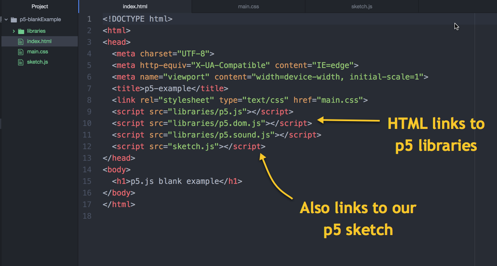
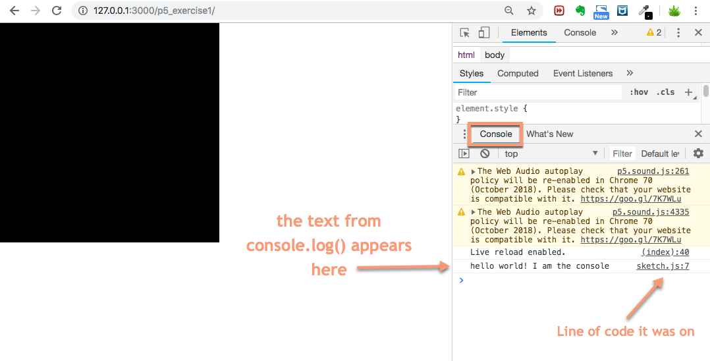
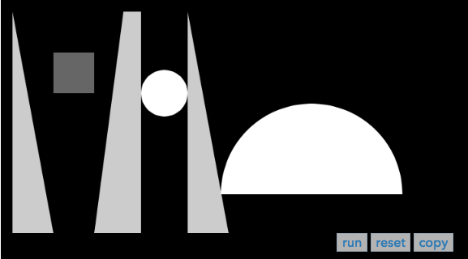

# Intro to Programming with p5.js

 ◇─◇──◇────◇────◇────◇────◇────◇─◇─◇
 

#### On this page:

1. [Resources](#-resources)
2. [Getting Started](#-getting-started)
3. [Code Basics](#-code-basics)
4. [Structure of p5](#-structure-of-p5)
5. [Color](#-color)
6. [Variables](#-variables)
7. [In-class exercise 1](#-in-class-exercise-1)

**NOTE: This is not intended as a stand-alone tutorial. It is supplemental material for following along in class. For those of you who missed class, do follow along with the understanding that not everything is spelled out. Running the code and making changes to it is highly recommended.**

---
 

# ▼△▼△▼ Resources

ALWAYS refer to the p5 documentation online at p5js.org

* ***[p5 reference docs](https://p5js.org/reference/)***
* ***[p5 examples](https://p5js.org/examples/)***

 

 

**Videos:** Dan Schiffman's [Coding Train YouTube channel](https://www.youtube.com/channel/UCvjgXvBlbQiydffZU7m1_aw) is GREAT, and hilarious, and so GREAT.

⬇⬇⬇⬇⬇⬇⬇⬇⬇⬇⬇⬇⬇⬇⬇⬇⬇⬇⬇⬇⬇⬇⬇⬇⬇⬇⬇⬇⬇⬇⬇⬇⬇⬇⬇⬇⬇⬇⬇⬇
#### ***HIGHLY RECOMMEND the Coding Train playlist [Foundations of Programming in JavaScript: p5](https://www.youtube.com/playlist?list=PLRqwX-V7Uu6Zy51Q-x9tMWIv9cueOFTFA)***
⬆⬆⬆⬆⬆⬆⬆⬆⬆⬆⬆⬆⬆⬆⬆⬆⬆⬆⬆⬆⬆⬆⬆⬆⬆⬆⬆⬆⬆⬆⬆⬆⬆⬆⬆⬆⬆⬆⬆⬆

 

**Books:**

* [*Getting Started with p5.js*](https://p5js.org/books/)
* [*Learning Processing*](http://learningprocessing.com/)
  - This is Dan Schiffman's book on Processing (predecessor to p5 - in Java not Javascript)

 

# ▼△▼△▼ Getting Started

1. Download and unzip the [p5-blankExample folder](blankExamples/p5-blankExample.zip) from GitHub, in the *blankExamples folder* of this tutorial.

* Copy it into your GitHub page local repository (the folder on your computer linked to the GitHub repo). Rename the folder "in-class_exercise_1"

* Open it in Atom. Start a server by with the package we installed: Packages > atom-live-server > start server.

* This will launch a browser page — if you add '/in-class_exercise_1' (or whatever you name the folder) to the end of the URL, it will display the contents of that directory: your p5 sketch live.

* It will just look like a black box for now...

---> *IF YOU ARE HAVING TROUBLE WITH ATOM-LIVE-SERVER, YOU WILL NEED TO CREATE A LOCAL SERVER USING PYTHON OR NODE*

* To do this, follow [this tutorial](https://github.com/processing/p5.js/wiki/Local-server).

* If on a mac, you can use the program 'terminal' to make these installations using the command line. If a windows user, you will have to [install git bash](https://gitforwindows.org/) to get access to the command line prompt.  

 

#### Folder setup

You should have a folder that has the familiar index.html and main.css files, along with a libraries folder and sketch.js file...

* These libraries ARE p5.js ---> P5 is basically a bunch of code that runs on top of JavaScript. We link to it from our HTML <head> to access all the p5 magic.  
* sketch.js is the JavaScript file where you write your p5 sketch. We also link to this in the HTML <head>.

 

*Review:* Do you know how to navigate folders using code? What does "../" do?

 

# ▼△▼△▼ Code Basics

#### Code blocks

    {
      a block of code
    }

    {
      a block of code
      {
        a block of code inside a block
      }
    }

 
Note the indentation: keeping all your lines properly indented will make your code more readable. To auto format using the atom-beautify plugin we installed, use the shortcut 'shift cmmd b'.

 

#### Case sensitive

Javascript is case-sensitive — hello is different than Hello.

The convention is to use camelCase - squish words together and capitalize first letter of every new word.

Start variable, function and method names with lowercase letters. Class names with a capitalized letter,
(we'll get into what these mean later).

 

#### Comments

Single-line comments start with // and are terminated by the end of the line:

    // single-line comment

Multiline comments are delimited by /\* and \*/:

    /* This is
       a multiline
       comment.
    */

 * Shortcut to comment out a line or block of code is 'cmmd /' or 'ctrl /'

 

#### Note on debugging

* ***DEBUGGING IS THE ART OF ISOLATING POTENTIAL PROBLEMS***
* It can be very frustrating, but also so satisfying when you figure it out
* Having people to work with can really help if you get stuck.

 

---> ***USE THE CONSOLE***

The console is your debugger buddy! Use it often to check that your code is working, or to try to figure out why it is not.

 

    console.log("hello world! I am the console")

Try adding the code above to your p5 setup() function. Open up developer tools in your browser (right click > inspect), and see what appears in the console.

 

***NOTE on console.log:***  You can log strings (words in quotation marks), or *the value* of a variable by using its name, with no quotation marks.

    console.log("text string")
    console.log(variableName)

 
 

# ▼△▼△▼ Structure of p5

**setup( ) and draw( ) are two functions that are built into p5.**

* Code within the setup() function block runs JUST ONCE AT SETUP.

* Code within the draw() function block loops over and over.

* You can only have one setup() and draw() function in your sketch.

 

To see this in action, paste this into your sketch.js (erase what is there first).

    // declare variables at top

    function setup() {
      // runs once
      console.log("in setup function")
    }

    function draw() {
      // loops over and over
      console.log("in draw function")
    }

    // write functions here

See what happens in the console?
 

#### Drawing in p5

See [object primitives example](https://p5js.org/examples/form-shape-primitives.html) in p5 docs  ⤵

 
***Note:*** The x, y graph coordinates start at the top left of your canvas.

    function setup() {
      createCanvas(500, 500);

      // set background color in grayscale:
      background(150);

      // draw ellipse
      ellipse(100, 100, 80, 80);

      // draw rectangle
      rect(100, 100, 80, 80)
    }

    function draw() {
      // no need to loop
    }

The default mode for the ellipse is to have the x, y coordinates mark the center, while rectangles by default are in corner mode.

You can change this with the functions:  
ellipseMode(CORNER);  
rectMode(CENTER);

 

    function setup() {
      createCanvas(500, 500);
      background(150);
    }

    function draw() {
      // loops because the shape is updated with
      // changing mouse position
      ellipse(mouseX, mouseY, 80, 80);
      rect(mouseX - 50, mouseY - 50, 80, 80)
    }

See what happens if you move the background(150); function into the draw loop.

You can achieve the same effect with clear(); at the top of your draw loop.

 

# ▼△▼△▼ Color

#### Finding RGB values

Digital Color Meter - native utility in Mac OSX

[Colorzilla](http://www.colorzilla.com/) is a browser extension for Chrome and Firefox that will give you the Hexcode and RGB value for any color on the page

#### Fill, Stroke, transparency

You can set the fill, stroke, and transparency by declaring them ABOVE the shape you are going to draw in your code.

 

    function setup() {
    	createCanvas(500, 500);
    	// background is very light grey
    	background(230);
    }

    function draw() {

    	// create bright green ellipse with white stroke
    	// fill is bright green
    	fill(0, 255, 0);
    	// stroke is white
    	stroke(255, 255, 255);
    	strokeWeight(1); // reset to default
    	ellipse(100, 100, 80, 80);

    	// make transparent rectangle
    	// a color fill with a fourth argument will define transparency
    	// fill has about 50% transparency
    	fill(255, 100, 50, 125);
    	noStroke();
    	rect(100, 100, 80, 80);

    	// stroke weight will set thickness of line
    	stroke(100, 200, mouseY, mouseX);
    	strokeWeight(5);
    	line(100, 100, mouseX, mouseY);
    }

 

Try changing color values to a random number.

To create a random integer from 0 to 255:  
random(255);

To create random integer between 100 and 200:  
random(100, 200);

 

# ▼△▼△▼ Variables

#### Scope

Variables declared at the top of your code are in the global scope. Variables declared in the setup() or draw() functions are only accessible within those functions.

ES6, the latest version of JavaScript, uses 'let' to define variables at block-level scope (within bracket blocks). We will be using let, but in many tutorials you might see 'var'.

    var myVariable;
    let myBlockScopeVariable;
    const MYCONSTANT;

Constants are read-only, and are generally all-caps.

Unlike Java (if you are familiar with Processing or Arduino), you do not need to declare a variable type in JavaScript — so no need for 'int' or 'float' or 'bool'.

 

Load this code, run it, and open up the developer's tools console in your browser (shortcut cmmd option i). See what errors and console logs you get. Move code around and observe how that changes.  

    function setup() {
    	console.log(hello);
    	console.log('hello');
    }

    function draw() {
    	let hello = 'hey';
    }

 

Note: Strings are defined within single '' or "" double quotes, and are text as-is.

Without the quotes, console.log will log the *variable* named hello.

Strings can be added together. Try adding this to your code:

    let p = "pets";
    let n = "Nala";
    console.log("My dog " + n + " loves " + p);

 

# ▼△▼△▼ Variables In-class exercise 1
