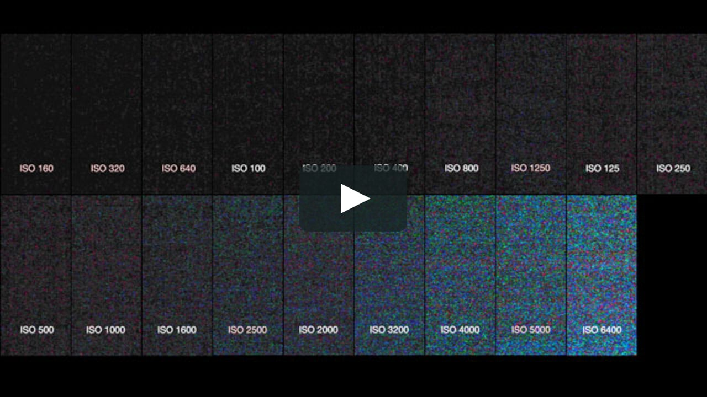
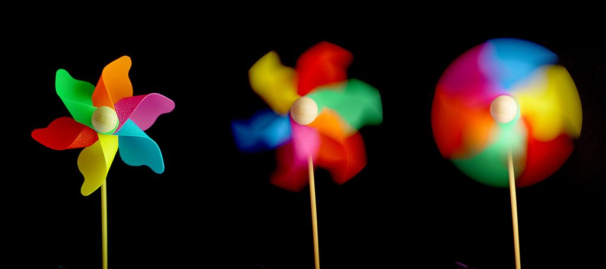
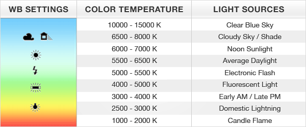

# ▼△▼ Shooting with DSLR cameras

 ◇─◇──◇────◇────◇────◇────◇────◇─◇─◇
 
 
 
##### Included on this page:

1. What is DSLR
2. ISO
3. Aperture
4. Shutter speed
5. White balance
6. Recording Audio
7. Checklist for getting good footage

#### ▼△▼△▼ **What is DSLR?**

DSLR cameras were designed for still photography, but have been embraced by indie filmmakers. The main benefit to using a DSLR camera for video is the shallow depth of field because of their large image sensors, relative to video camcorders. Also, DSLRs can capture video at 24 frames-per-second (film standard), as opposed to the 29.97fps (TV/video standard). For these reasons, DSLRs can produce a very seductive 'film-like' image. The cons are that they aren't really designed for video. Some models don't have rotating viewfinders for shooting from different angles, and some controls are difficult to control while recording.

#### ▼△▼△▼ ISO

* Adjusts how sensitive your camera is to light.
  * Higher ISOs are more sensitive to light - they will bring up exposure in low light situations. BUT high ISO's will make the image grainy. The rule of thumb is to make your ISO *as low as possible*. The goal is to find balance between exposure and grain.

*Here's a chart showing ISO brightness and noise (don't bother trying to press play in this image, it's a still from Vimeo ;-)*

 
 

#### ▼△▼△▼ Aperture

* Controls amount of light reaching the image sensor. Think of it like a pupil dilating and constricting to let more/less light in. You measure aperture with the f-stop
  * Lower aperture settings let more light in. So an aperture of 1.8 is more open and lets more light in than an aperture of 8.0.
  * Lower aperture settings have a **shallow depth of field**, also known as shallow focus.  
  * Higher aperture settings create a larger depth of field, or deep focus.

 
 

#### ▼△▼△▼ Shutter Speed

* Slower frame-rates will produce
* Rule of thumb: double your frame-rate to have you an approximation for you ideal shutter speed
  * So if you are shooting at 24fps, double that is 48. There is no 1/48th shutter speed, so you round to 1/50th sec.
  * Shooting at 30fps ---> shutter speed of 1/60th sec
* Lower shutter speeds create more motion blur, whereas higher shutter speeds (faster) will create sharper but stutter-y movement.
  * High shutter speeds are good for capturing fast-moving action like sports
* Lower shutter speeds will let more light in, higher shutter speeds will darken your image.

*Blur with low shutter speed*
 
 

#### ▼△▼△▼ White balance

* White balance is basically telling your camera what color temperature you are shooting in
  * Different light bulbs have different temperatures, making more-blue or more-yellow light.
* You can use presets, or set custom white-balance (preferred). Avoid using auto-white balance! It will cause color-fades in your image.
  * It is also possible to adjust white balance Kelvin temp with the dial (at least on Canons).

 
 

#### ▼△▼△▼ Recording audio

* DSLRs have really poor built-in audio recording, because they are not designed for video.
* Use the best microphone possible!
* Minimize background Noise
  - Hard to do outside
  - Inside: Turn off appliances, lights, air conditioning, shut windows
* Keep microphone closest as you can to subject without microphone it being the shot
  - Watch out for "pops" from puffs of air if mic is too close to subjects mouth
* As loud as possible without peaking
  - NO PEAKING - don't want sounds to go into the red
  - Voices ~ -6dB - -12dB
  - Careful about handling the mic
  - Always edit with headphones

 
 

#### ▼△▼△▼ Tips for getting good footage

* Keeping the camera steady
  - Use tripod or camera stabilizer
  - Keep handheld image steady by using a strap around neck or stabilizing arms against hips
* Increase the lighting
* Set white balance
* Get things in focus
  - Zoom in to focus (DSLRs use digital zoom button)
  - Zeroing in with lens
  - Make sure you are in focus if shooting yourself
    - Focus on an object where you will be
    - Get someone else to focus for you
* Depth of Field
  - Adjust aperture
    - Low F-stop (bigger hole) = shallow depth of field
    - High F-stop = deep depth of field (everything in focus)
* Expose it well
  - Set your Aperture
  - Set ISO
  - Control 'exposure'
