# Lighting and Green Screens

 ◇─◇──◇────◇────◇────◇────◇────◇─◇─◇
 

##### Included on this page:

1. [Lighting basics](#-lighting-basics)
2. [Studio lighting](#-studio-lighting)
3. [Green screen lighting](#-green-screen-lighting)
4. [Keying out a green screen in Premiere](#-keying-out-a-green-screen-in-premiere)
5. [Equipment tips](#-equipment-tips)

 
 

# ▼△▼△▼ Lighting basics

When designing the lighting for your shot, think about what effect you are going for. Do you want it to be dramatic with hard angular lights? Or do you want it to have soft, diffuse light? Do you want the background to be in shadow?

---

### Color temperature and white balance

* Studio lights have different color temperatures, which will affect your white balance. Florescent lights are bluer, while tungsten lights are more yellow in tone. LED lights vary.

* If you have multiple light sources (ie sunlight from window as well as interior lights), you will likely ave mixed colors in your light.

* ***Use a white or grey card to capture the white balance at the beginning of the shot. This will make it much easier to do color correction in Premiere***   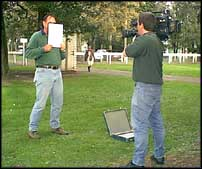
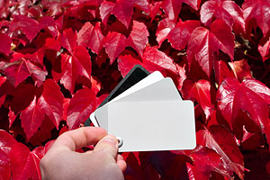

 
 

---

### Gels

Use gels to color light from different sources.

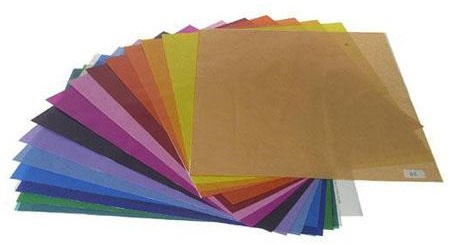

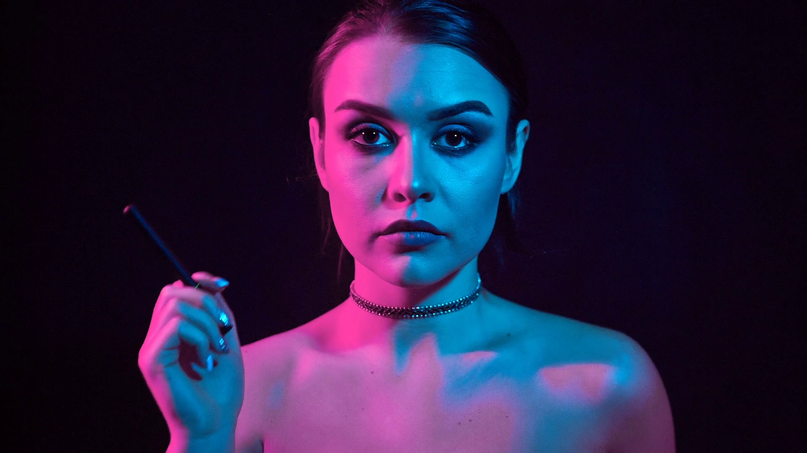
 
 

---
### Hard versus soft light

* More diffuse light will create soft shadows. "Hard" light has more defined shadows.

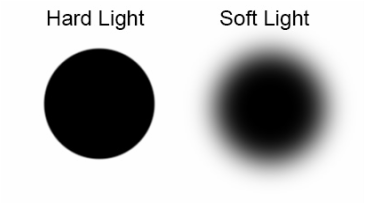

* To get soft light, you will need to diffuse the light, or bounce it off another surface ----> See below.

* Hard light is achieved through an unfiltered light, pointed directly at the subject.

* Hard light can be used for dramatic effect.

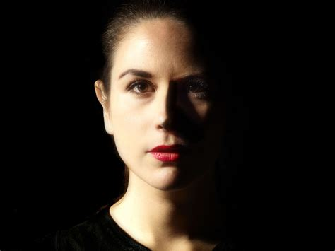

* Hard light can also cast awkward shadows....

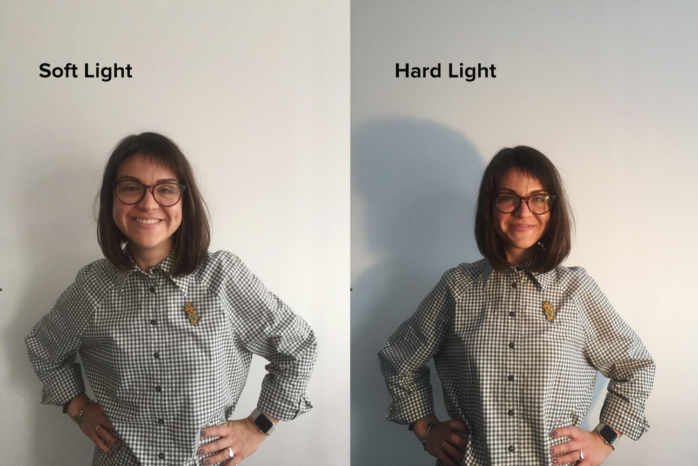

 
 

---

### Bouncing light
----> ***Bounce off wall:***
* You can bounce light off a white ceiling or wall

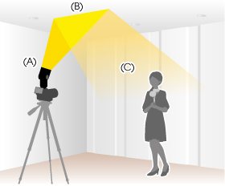

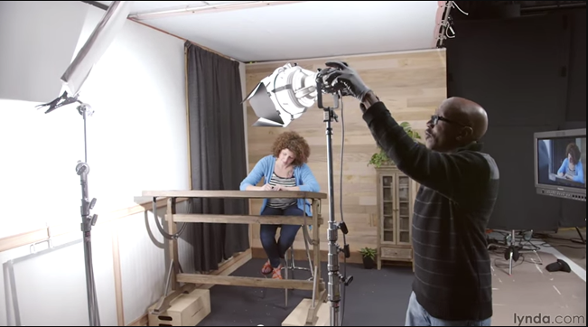

* [Tutorial for bouncing light in video](https://youtu.be/GWr3dsxMXhQ)

 

----> ***Bounce with reflectors:***
* You can also use bounce cards / reflectors. These are often white, silver, or gold.

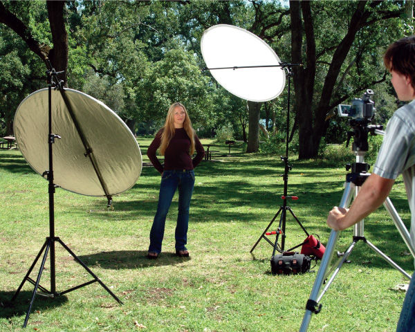

 
 

---

### Diffusing light

* Soft boxes are used to diffuse light.
* The bigger the box, the softer the light.
*
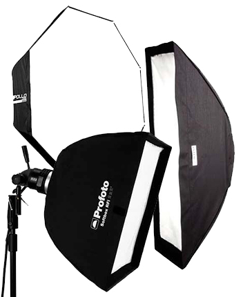

 

* They can be quite expensive. Check out [these examples of DIY softboxes](https://www.diyphotography.net/how-to-build-24-diy-softboxes/)

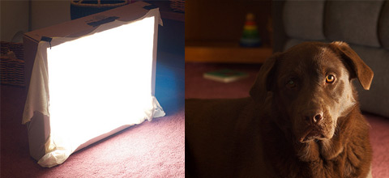 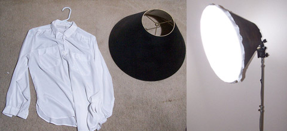   
A clip light with parchment or wax paper (for baking) works well.

 
 

# ▼△▼△▼ Studio lighting

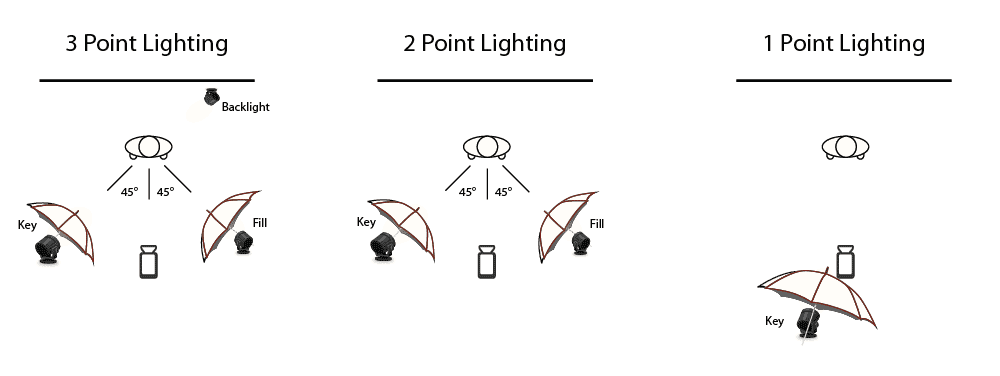

1. ***Key Light***: The brightest light source. Often placed in front of subject at an angle.
* ***Fill Light***: Less bright than the key, the fill adds light to fill in shadows.
* ***Back/hair Light***: This light is positioned behind the subject, to help light the back of their head so that they stand out from the background.
* ***Background Light***: Illuminates background objects.

 

---

### Three point Lighting

Convention for studio interviews.

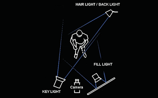 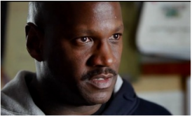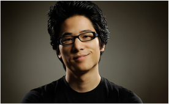 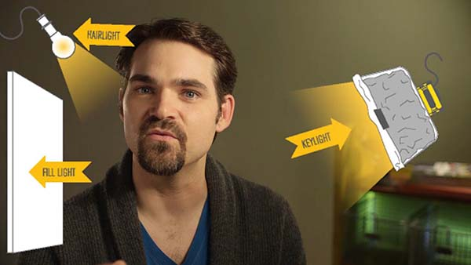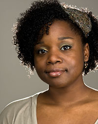

 
 

# ▼△▼△▼ Green Screen lighting

KEEP IT BRIGHT: For a color key to work well, you will need it to be brightly lit! Dark green screens do not key well.

Ideally you would have four or more lights to light a green screen: 2-3 for your subject and 2 for the screen. But you can get away with 2....

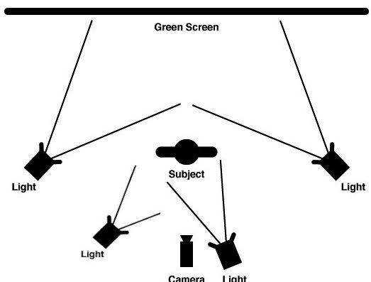

#### IMPORTANT:

* You want your green screen to be ***evenly lit.*** Uneven lighting will mess up your key.

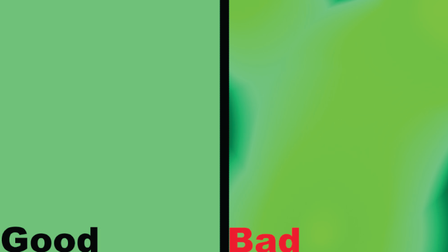

 

* ***Avoid shadows***
  * Move lights off to the side to avoid shadows on the green screen
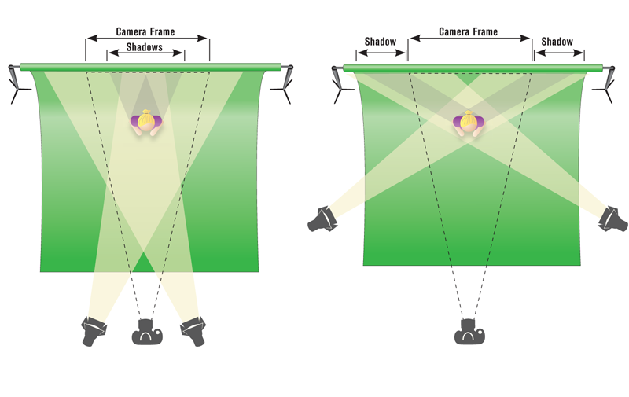

* Watch out for ***green light "spill"*** on your subject.

 

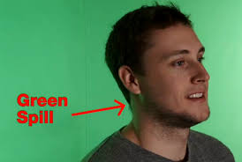 Happens when light from green screen hits your subject

  * To avoid spill: Have them step farther away from the screen. At least 5ft is a good rule of thumb.

 

---

***BRUSH UP YOUR KNOWLEDGE***

* Before you shoot a green screen, watch some tutorials to make sure you know the basics...
  * [Hilarious and short green screen YouTube tut](https://www.youtube.com/watch?v=uJUvFXwClSk)
  * [4 minute Lynda video tut](https://www.youtube.com/watch?v=wD5Z822aT5U)

 
 

# ▼△▼△▼ Keying out a green screen in Premiere

Premiere's ***ULTRA KEY*** effect is a very effective tool. For more fine tuning, you can use ***Keylight*** in After Effects.

Follow this [**ULTRA KEY TUTORIAL**](https://photofocus.com/2018/03/07/how-to-key-greenscreen-video-in-adobe-premiere-pro/) --> it is pretty easy to use.

 
 

# ▼△▼△▼ Equipment tips

* Make sure your stand is properly assembled and sturdy enough to support the light.
* Be careful wires are not a tripping hazard
* Take care to coil your cables properly! [Watch video tutorial here](https://www.youtube.com/watch?v=cpuutP6Df84)
* CARE FOR THE SCREENS: Keep them clean.
* Make sure lights have time to cool down after they are used, and do not touch the bulbs with your bare fingers (the oil on your hands could )
