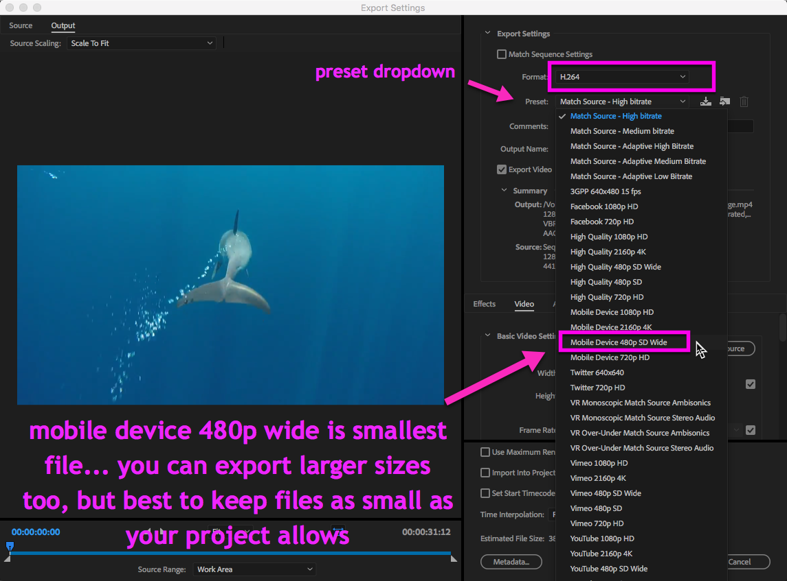
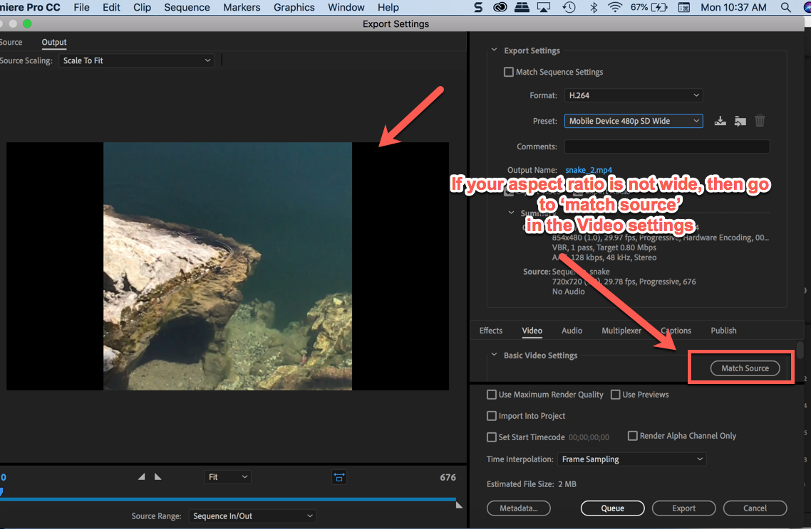
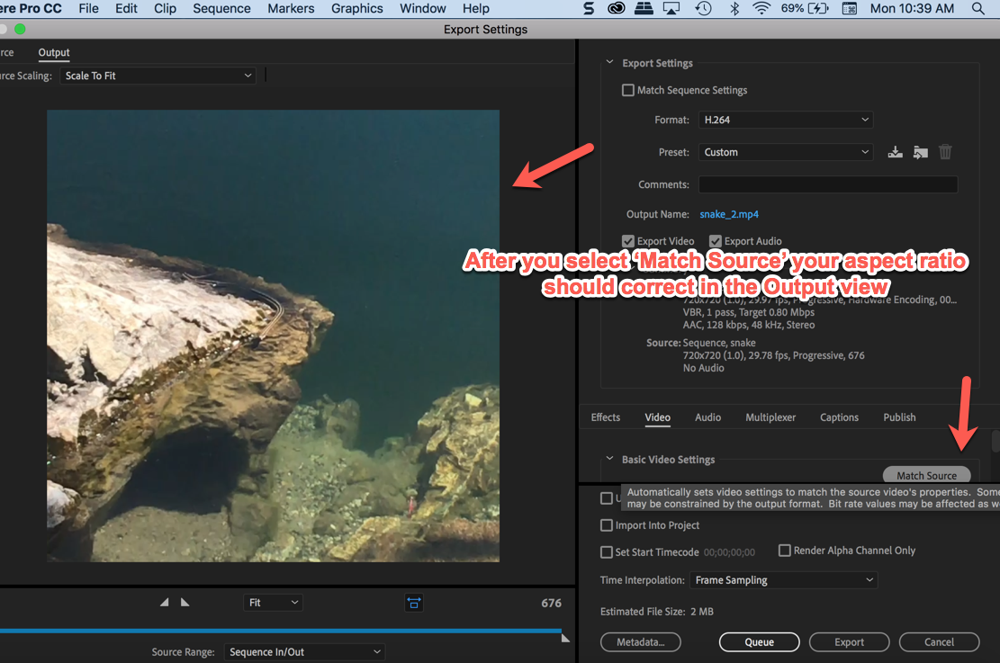
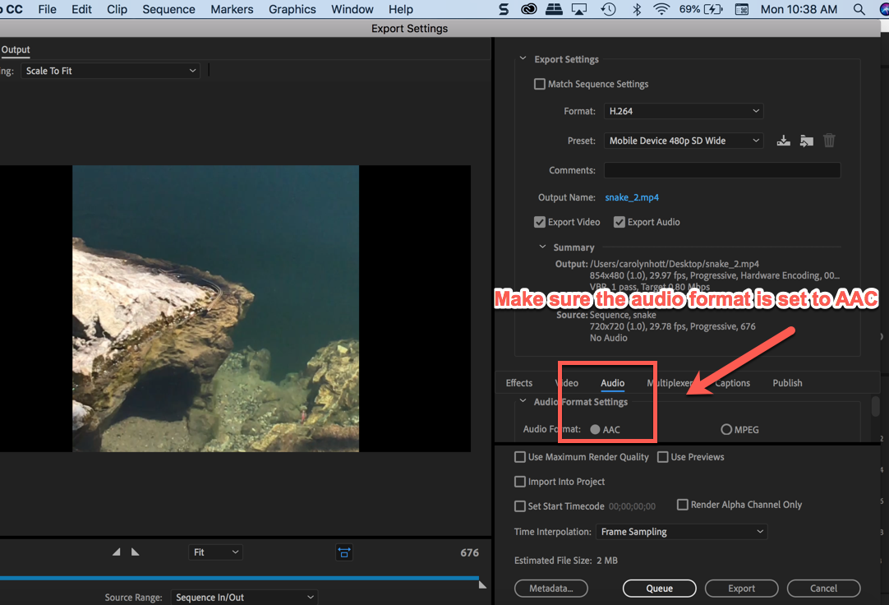
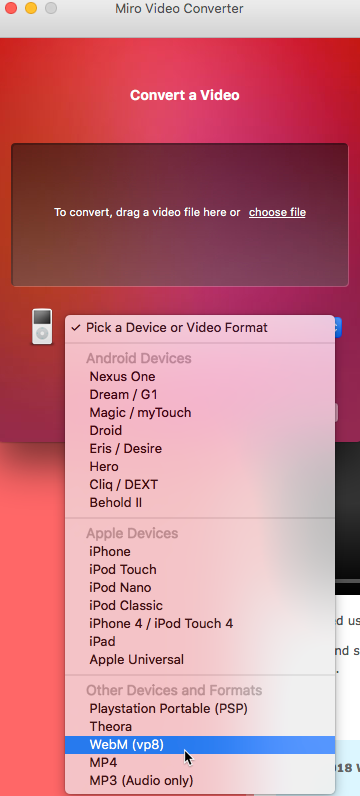
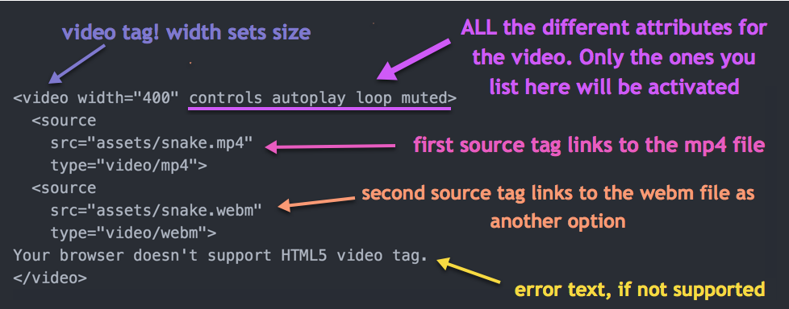

# HTML5 Video Tag

 ◇─◇──◇────◇────◇────◇────◇────◇─◇─◇
 

#### **On this page:**
1. [What is the HTML Video Tag?](#-what-is-the-html-video-tag)
2. [Prepping Video Files](#-prepping-video-files)
3. [Using the Video Tag](#-using-the-video-tag)

 

# ▼△▼△▼ What is the HTML Video Tag

This is different than using Vimeo or YouTube to host our video in an iframe! You are playing the video file *off your site*, not through YouTube or Vimeo.

The advantage to using the HTML5 video tag is that you ***will not have the Vimeo / YouTube logos***, and have a little more control.

The downside is that you have to host the videos on your website, which means ***file compression is VERY IMPORTANT***.

# ▼△▼△▼ Prepping Video Files

Codecs are types of video compression, ie .mp4, .mov, .webM...

[Not all browsers and mobile devices](https://www.w3schools.com/tags/tag_video.asp) can play all video codecs, so you should **always have two files for each video, an .mp4 (H264) and a .webM.**

#### 1) .mp4
You can export the .mp4 right out of premiere. In exports, select H264 (which is an mp4 codec), then open up **the presets drop-down menu** to find "mobile device 480p wide".

(You can try out other compression sizes too, just check out the file sizes - estimated at the bottom - and try to keep them as small as possible.

And there is your .mp4!

**Tip:** If your video exports with an aspect ratio that is different from your original, then select 'Match Source' in the video settings:

Also make sure that the Audio setting is set to AAC:

 

#### 2) .webM
To get your .webM file it is a little trickier. You can either download a plugin for Premiere (this is free to do, YouTube tutorial [here](https://www.youtube.com/watch?v=L7a5r8lbo0A) should work), or you can download a free video converter like [Miro](http://www.mirovideoconverter.com/.)

If using Miro, you drag your video into the top, then select webM from the dropdown.

 
 

# ▼△▼△▼ Using the Video Tag

[W3 Documentation](https://www.w3schools.com/tags/tag_video.asp) for the video tag
[MDN documentation](https://developer.mozilla.org/en-US/docs/Web/HTML/Element/video) for the video tag

---> Check out the live demo on the [course website](https://art75.github.io/)
---> Download sample code for the demo [here](https://github.com/art75/art75.github.io/tree/master/codeDownloads)

### HTML <video> tag
Here is the breakdown of the video tag:

Note there are a few attributes listed in the opening tag. If you list them, they are enabled
* controls: this displays the play button
* loop: loops the video
* autoplay: autoplays on page load.
  * *In Chrome you need to have the video muted for it to autoplay*
* muted: mutes video

### CSS to style videos

You can style the video using the "video" selector in your css

    video {
      margin-top: 50px;
    }

You can also add a class to your video tag, and style each video differently.

In the [demo](https://art75.github.io/net-art/templates/HTML_videoTag/), the video is given the class "snake-vid".

    <video class="snake-vid" width="400" controls loop>
	  <source
			src="assets/snake.mp4"
			type="video/mp4">
		<source
			src="assets/snake.webm"
			type="video/webm">
		Your browser doesn't support HTML5 video tag.
	</video>

Which is referenced in the css:

    .snake-vid {
      background-color: #96add3;
      padding: 50px;
    }
